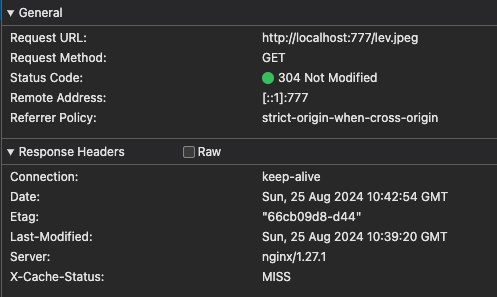
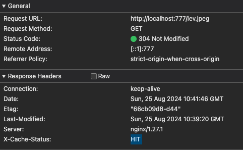
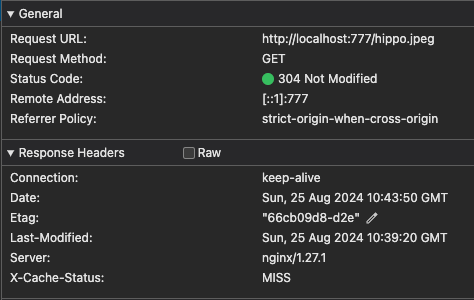
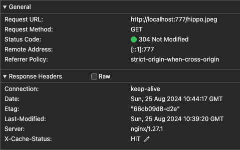
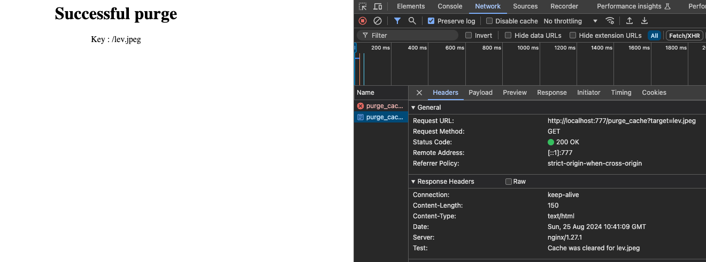
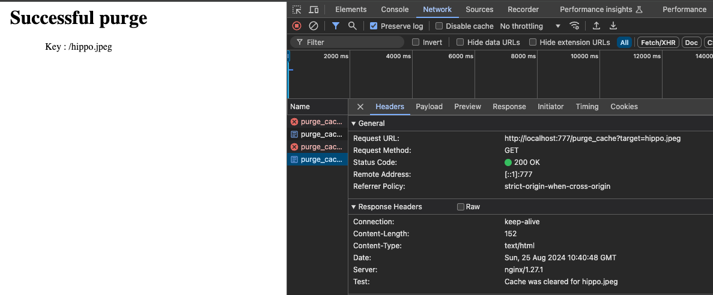
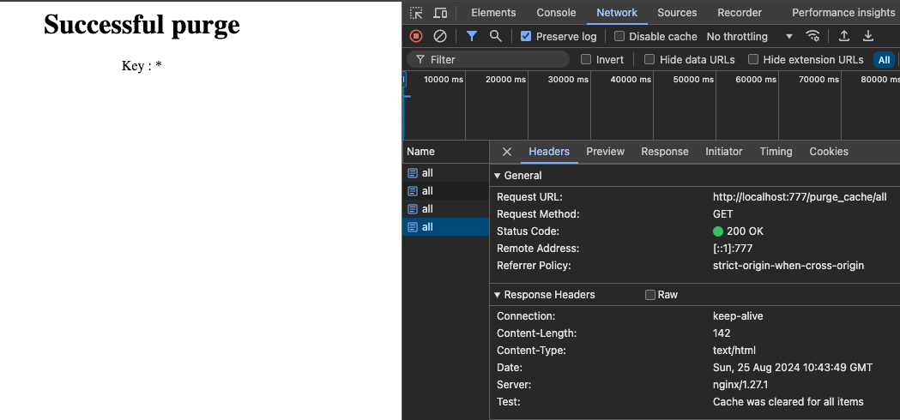

# hsa-nginx-fine-tuning
Nginx Fine Tuning

## How to start
1. Clone the repo to local machine
2. Run `docker-compose up -d`

## How to test
1. Head to `localhost:777/lev.jpeg` or `localhost:777/hippo.jpeg`
2. Examine network for response header `X-Cache-Status`, if requested image was requested at first - it will be `MISS`, otherwise - `HIT`
   1. 
   2. 
   3. 
   4. 
3. Run shell script `change-images.sh`
4. Head to given URIs(any) and examine header `Test`
   1. `localhost:777/purge_cache?target=lev.jpeg`  
   2. `localhost:777/purge_cache?target=hippo.jpeg`  
   3. `localhost:777/purge_cache/all` 
5. After that head again for original images, their content should change and cache itself again after 1st use
